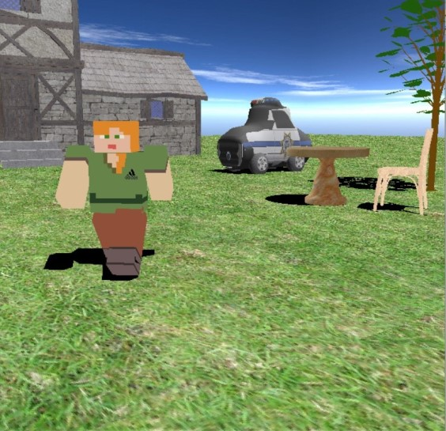
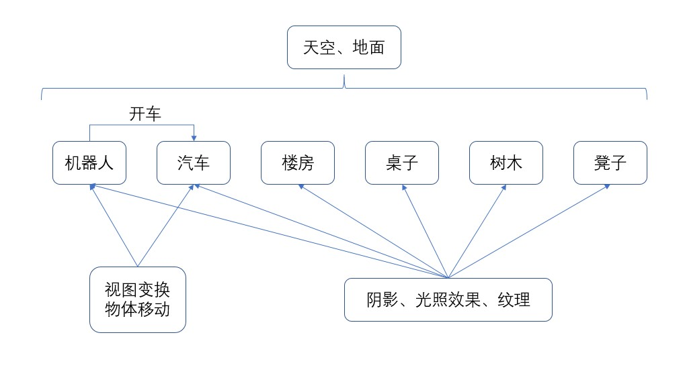
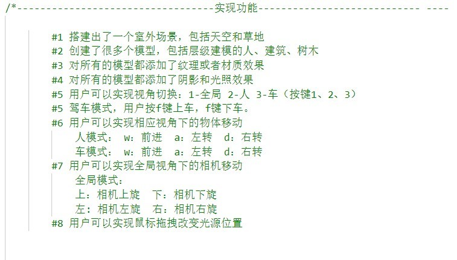
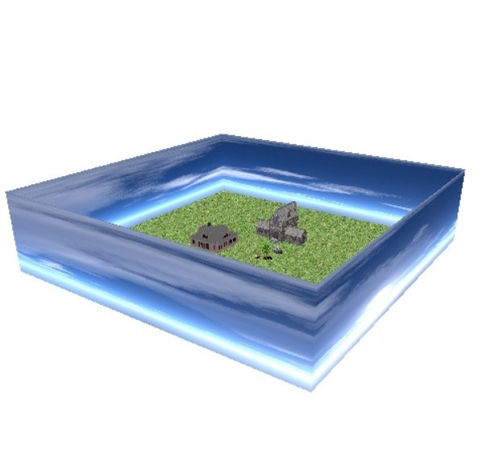
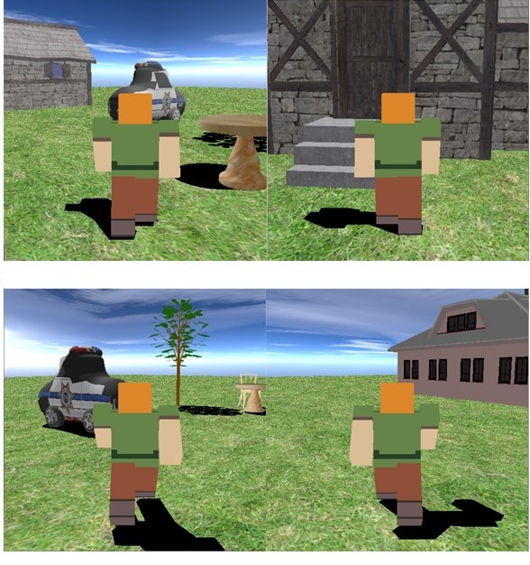
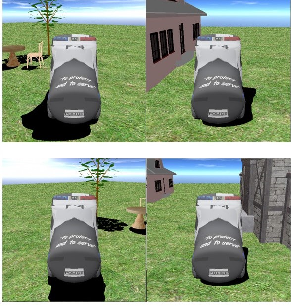

# My-CG-Project
计算机图形学-大作业

## 场景预览

## 模型的层次结构框图
 
 

## 键盘的交互
### 按键1：切换到场景视图
#### 在这个视图下，用户以上帝视角查看周围环境，在这个视角下，允许使用的操作有上、下、左、右键分别移动相机的角度，滑轮控制相机的远近。
 

### 按键2：切换到人视图
#### 在这个视图下，用户以人视角观看场景，用户允许使用的操作是w、a、s、d，分别控制人的前进、左转、后退、右转，效果如下。
 
 
### 按键3（或者f键）：切换到汽车视图，开车
#### 这个视图下，用户以人视角观看场景，用户允许使用的操作是w、a、s、d，分别控制汽车的前进、左转、后退、右转，效果如下。
 
